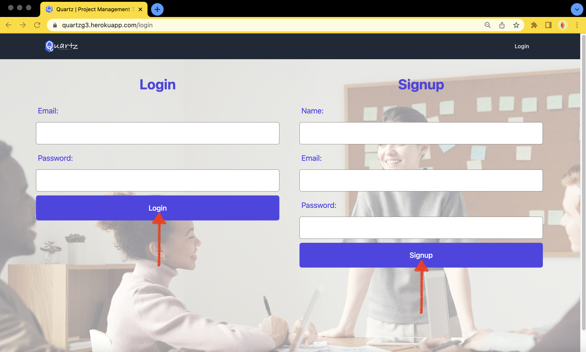
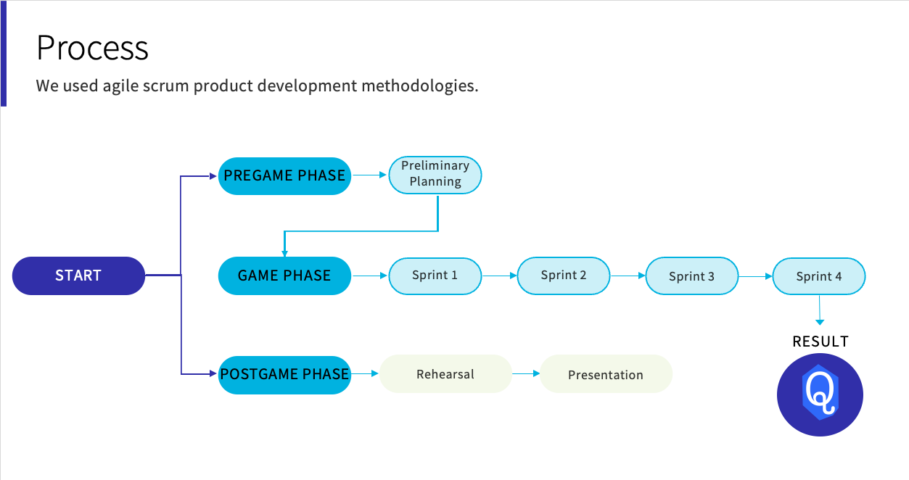

# Interactive-Full-Stack-Application

## Project Description:
* This team successfully created an interactive full-stack application.

* Users can  
* This application was accomplished using  and the following languages:
  *  33.5% Handlebars
  *  30.4% CSS
  *  24.9% JavaScript
  *  11.2% SCSS

 

#### You can access this project via [GitHub](https://github.com/BrianLalli/Quartz)
#### You can access this project via [Heroku](https://quartzg3.herokuapp.com/)

 

## Epic & User Story:

 

## How It Works:
First, you are brought to a landing page where you can get started.

 

Then, you can either login or sign up.

 

Next, you can create a new project and see all your existing projects.

 

Click on Projects to see all projects in the database and edit the data for specific projects.

 

Lastly, you can view your dashboard and see your project stats as well as global user stats.

 

## Credits:

* [Itzel Cole](https://github.com/Itzelmariana)
* [Andrew Edwards](https://github.com/Andrew87E)
* [Joel Prentiss](https://github.com/joelprentiss)
* [Brian Lalli](https://github.com/BrianLalli)

 

## Process

 

## Challenges & Solutions:

 

## Future Development:

 

## Wireframes:

 

Copyright (c) 2022 Brian Lalli
